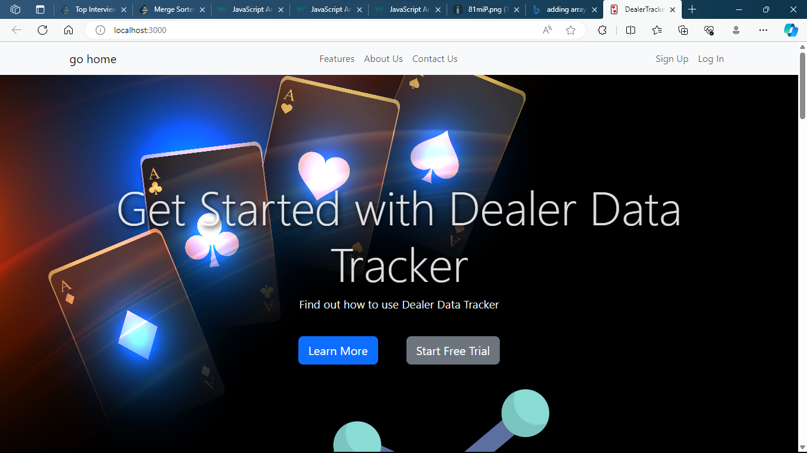
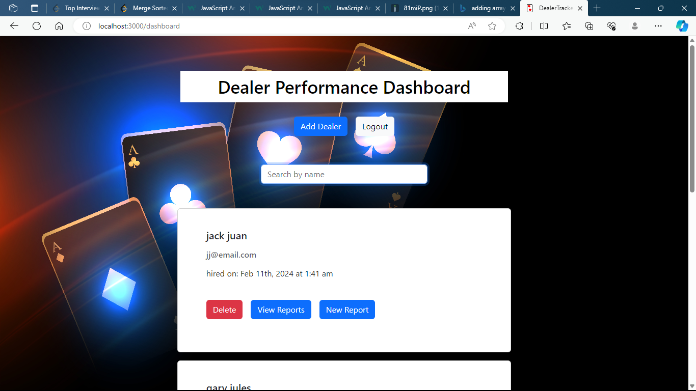
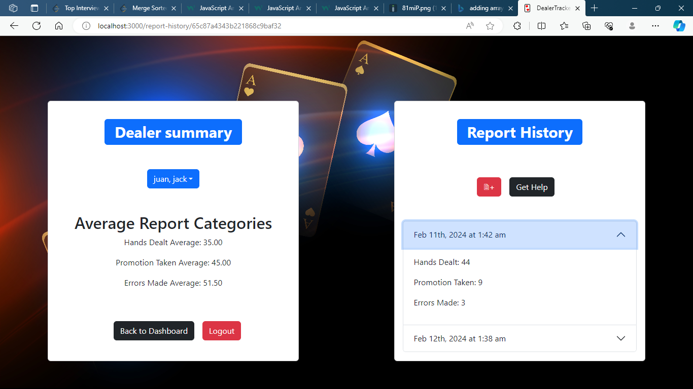

# dealer-data-tracker

## Description
    We embarked on this project to be able to track any metrics that a workplace might like to keep track of. This specific app was built with a pokerhouse in mind. Created to allow supervisors to keep records when they audit their dealers metrics and store them to track a dealers preformance over time. 

## Table of Contents (Optional)

- [Installation](#installation)
- [Usage](#usage)
- [Credits](#credits)
- [License](#license)

## Installation

If you are setting up this program for development the steps to take to get in installed and running are... 
1. clone this repo
2. open the file in command line and run 'npm install' to install dependancys
3. use 'npm run build' then 'npm run start' to build the file and start server (alternatively you can also use 'npm run develop')

## Usage

to use this app is simple just navigate to our website at https://dealer-data-tracker.onrender.com/ , then create a account by clicking in the upper left corner on sign up. After you create the account you gain access to your dashboard and all its cool features. From the dashboard you can;
- View your dealers
- Add a dealer
- add a report for a dealer
- delete a dealer
- go to report history
and from report history they can then;
- View previous reports
- View average of dealer metrics across all reported reports
- Add a new report
- Change what dealer you are viewing

## Credits

This app was created by:
Joshua Bradshaw, https://github.com/Jbradu2 ,
Luis Flores, https://github.com/florezf90 ,
Noah Lara, https://github.com/N-lara ,

we also owe credit to the creaters of Express, Apollo, GraphQL, MongoDb, Mongoose, JWT, JWT-decode, Bcrypt, Nodemailer, Vite, Bootstrap, React, React-Bootstrap, React-Router-Dom, and FontAwesome for their great npm packages.

## License

🏆MIT License

## How to Contribute

If you are feeling inclined to contribure feel free to contact us on our githubs or something I believe in you.

## Future

In the future there would be some great additions we would like to make such as, adding the ability to edit your account email or password, also password resetting, and deleting reports, and using PWA to make it avalible offline